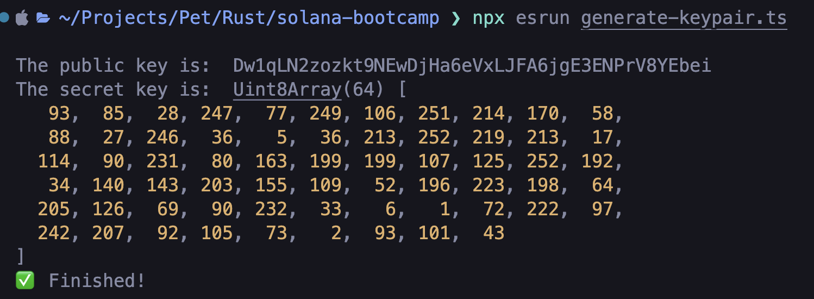
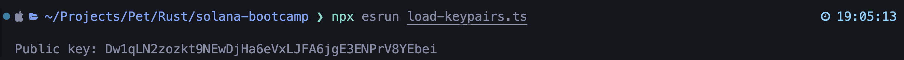
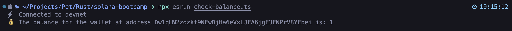
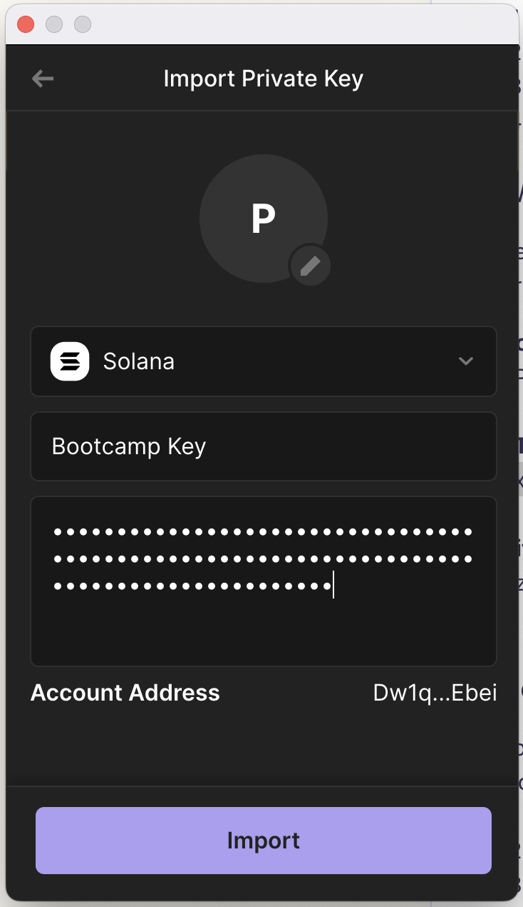
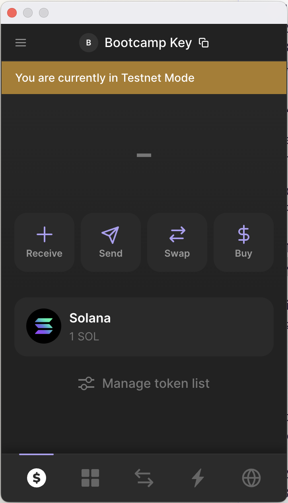
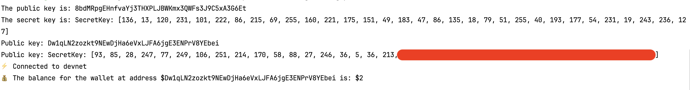

# Практика 1 - 2024-08-08

## Results

### Practice 1: Generate keys

### Practice 2: Load keypairs

### Practice 3: Check balance

### Practice 3: Add a git link
Done ✅

### Practice 5: Add devnet wallet to Phantom

As we can see, there is 1 SOL in my wallet, as I airdropped earlier.

### Practice 6: REWRITE THAT IN RUST!!!🦀

Done ✅

I created a Cargo manifest file at the root directory, and wrote three
functions inside /practice-1. I call each of those functions in the 
`main()` function.

Here are the results from Rust:
